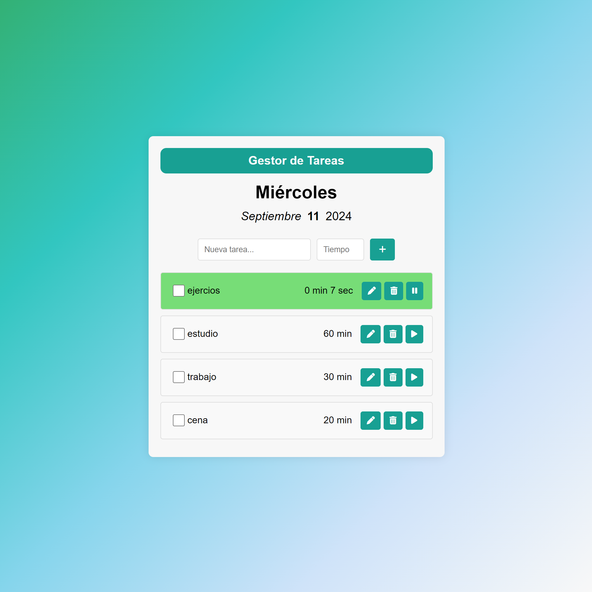

# Lista de Tareas con Temporizador Pomodoro

Este es un proyecto de gestión de tareas con integración de temporizador estilo **Pomodoro**, creado con **HTML**, **CSS** y **JavaScript**. Permite crear tareas con tiempo asignado, editarlas, eliminarlas y marcarlas como completadas.

## Características

- **Interfaz intuitiva**: Lista de tareas clara con botones para editar, eliminar o iniciar temporizador.
- **Temporizador Pomodoro**: Puedes asignar un tiempo por tarea (0–60 min) y activar una cuenta regresiva.
- **Visualización de la fecha**: Muestra el día, mes y año actual dinámicamente.
- **Diseño responsive**: Se adapta a dispositivos móviles, tablets y pantallas de escritorio.

## Tecnologías Utilizadas

- **HTML**: Para la estructura de la interfaz.
- **CSS**: Para los estilos visuales.
- **JavaScript (Vanilla JS)**: Para la lógica del temporizador, tareas y manipulación del DOM.
- **Font Awesome**: Para los íconos de edición, borrado y temporizador.

## Vista Previa del Proyecto



> Puedes ver el proyecto funcionando en vivo aquí:  
> 🔗 [https://ingjoseyepez.github.io/lista-de-tarea/](https://ingjoseyepez.github.io/lista-de-tarea/)

## Cómo Ejecutarlo Localmente

1. Clona el repositorio:
   ```bash
   git clone https://github.com/ingjoseyepez/lista-de-tarea.git
